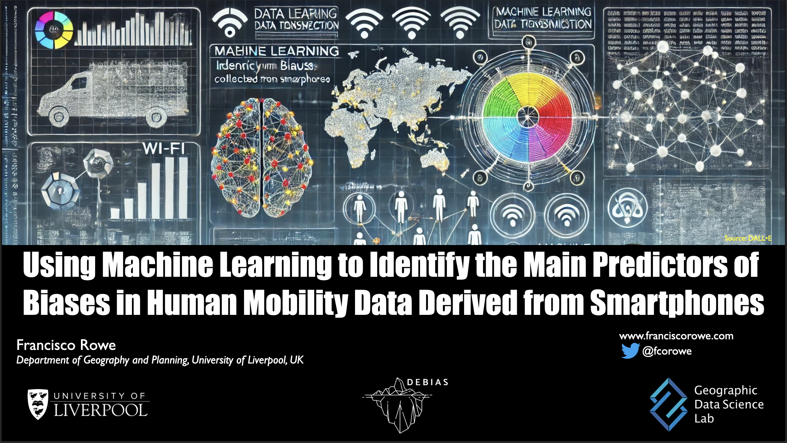

DEBIAS delivered a presentation at the Liverpool Advanced Methods for Big Data Analytics (LAMBDA) Research Centre hosted an interdisciplinary workshop titled ‘Machine Learning and AI’ on Friday 15 November 2024. Francisco presented work identifying the key area-level predictions contributing to increasing biases in human mobility data derived from mobile phone applications using explainable machine learning.

{fig-align="\"centre"}
