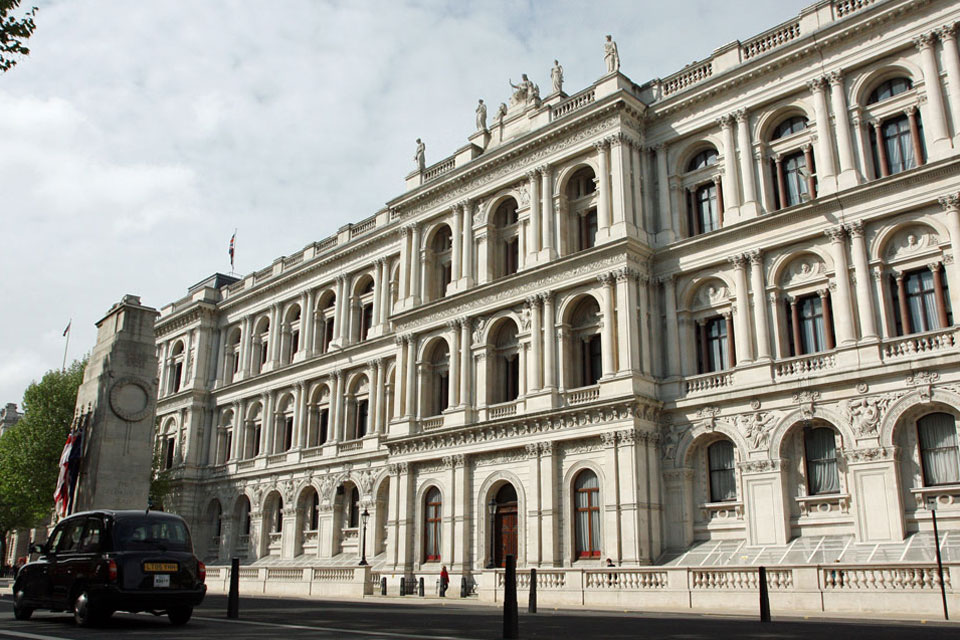

Francisco was invited to present how work on the use of human mobility data extracted from smartphones to develop population-level estimates at the Foreign, Commonwealth and Development Office (FCDO). The FCDO closely monitors the impacts of the Ukraine-Russia conflict on local economies and the speed of their recovery.

