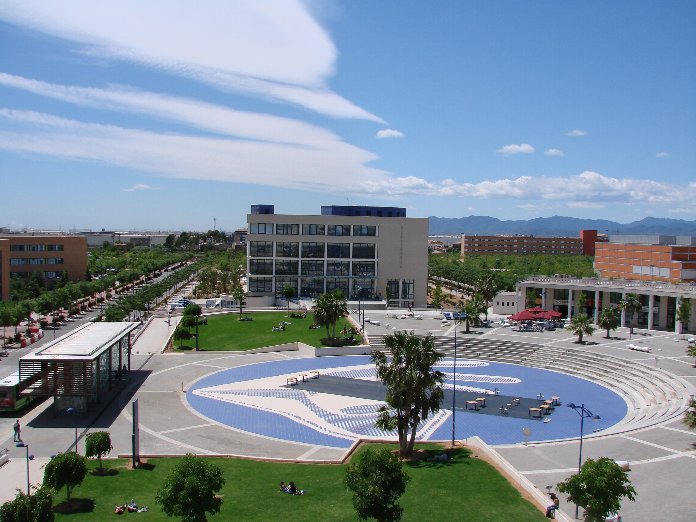

Carmen was pleased to be invited as a guest lecturer at the [Erasmus Mundus MSc in Geospatial Technologies program](https://mastergeotech.info/master-program/description/). This international Master’s program is supported by the EU through the European Commission’s Erasmus+ programme, Erasmus Mundus action (2021–2027, project number 101049796). The MSc in Geospatial Technologies is a collaborative effort among three institutions, and the students get to spend a semester at each:

-   University of Münster, [Institute for Geoinformatics](http://ifgi.uni-muenster.de/), Münster, Germany.

-   Universitat Jaume I (UJI), Castellón, [Dept. Lenguajes y Sistemas Informaticos](http://www.geotec.uji.es/), Castellón, Spain.

-   Universidade Nova de Lisboa, [NOVA – Information Management School](http://www.novaims.unl.pt/index.asp), Lisboa, Portugal.

During her lecture at UJI, Carmen shared insights into DEBIAS and provided an introduction to network analysis for GIS. She demonstrated the potential of digital trace data in research while addressing the challenges related to addressing representativity biases in such data. The session encouraged students to critically consider both the opportunities and limitations of mobility data derived from digital technologies.

