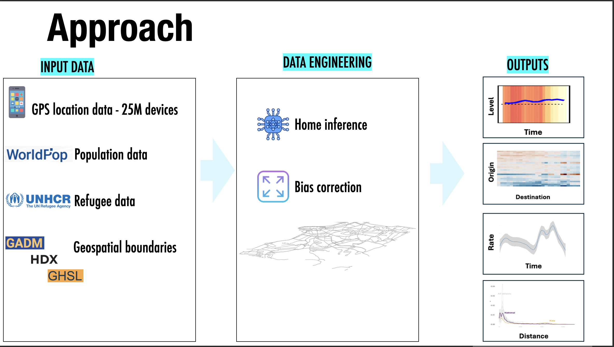

Francisco presented *Estimating Internal Displacement in Ukraine from High-Frequency GPS Mobile Phone Data* at the Wittgenstein Centre Conference 2025, *Demographic Perspectives on Migration in the 21st Century*, hosted at the Austrian Academy of Sciences in Vienna, Austria, on 19 November 2025.

This talk presented methods to estimate internal displacement in Ukraine from high-frequency GPS mobile phone data, focusing on timely measurement and policy-relevant inference under crisis conditions.

The presentation examined how high-frequency mobile phone location data can support the measurement of internal displacement during rapidly evolving humanitarian crises. It emphasized the importance of producing timely and policy-relevant evidence to better understand population movements under conditions of conflict and instability.

The talk highlighted approaches to transform GPS mobile phone data into useful displacement estimates, contributing to broader efforts to strengthen migration and displacement research with new forms of digital trace data.

