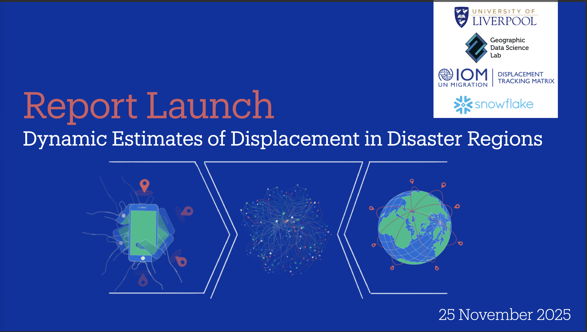

Francisco presented *Dynamic Estimates of Displacement in Disaster Regions* at the International Organization for Migration Report Launch, held online on 25 November 2025.

This talk presented dynamic estimates of displacement in disaster regions, highlighting policy-relevant approaches to triangulate multiple data sources for timely and actionable evidence.

Access to timely information on displacement is essential for operational response and recovery planning in disaster-affected regions. The presentation focused on how digital trace data and related information streams can be combined to generate dynamic estimates that support decision-making under rapidly changing conditions.

The talk discussed the value of integrating multiple data sources to produce more responsive and policy-relevant measures of displacement, helping humanitarian and policy actors better understand population movements and target support where it is most needed.

