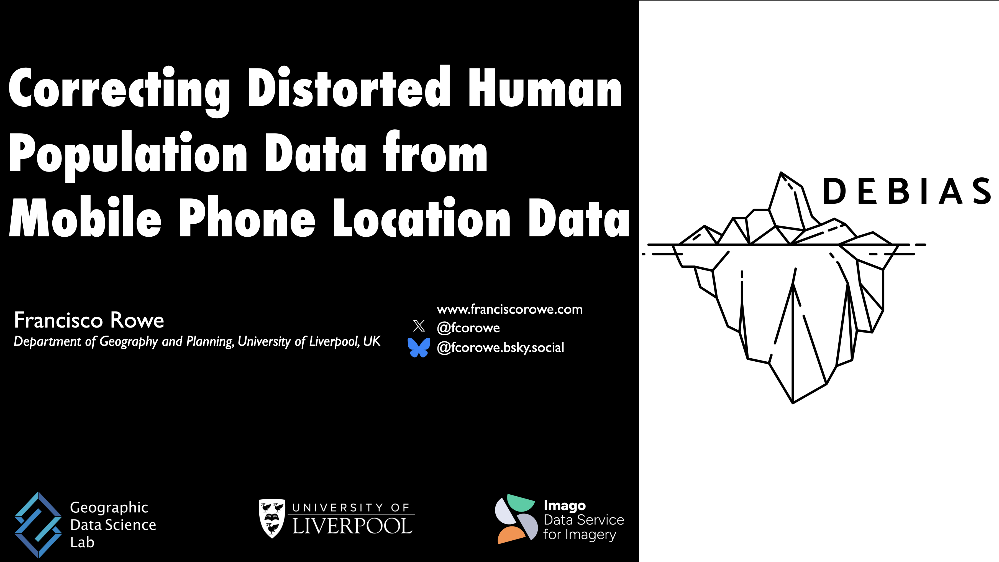

Francisco presented *Correcting Distorted Human Population Data from Mobile Phone Location Data* at the London Universities Population Seminar Series, hosted at Connaught House, London School of Economics, on 20 January 2026.

Access to human population data is key for a wide variety of social challenges, including urban planning, sustainability, public health, and economic development. Location trace data collected through digital technologies, such as mobile applications and internet protocol data, have become widely available to study human mobility and overcome key limitations of traditional data streams such as surveys and censuses. Yet digital trace data are not representative of the general population and consequently require statistical adjustment to mitigate existing biases and support robust statistical inference.

The talk presented work from DEBIAS, one of the Smart Data Research UK-funded accelerator projects, which aims to develop a generalisable framework to measure, assess, and correct existing biases in human mobility data extracted from digital trace data. First, it introduced a measure to quantify biases in spatial population counts derived from digital trace data and identify the key demographic, socioeconomic, and geographic features underlying these biases. Second, it outlined a proposed framework to mitigate biases in spatial population count data and generate bias-adjusted digital footprint human mobility counts. Third, it presented plans for future work in this area.

