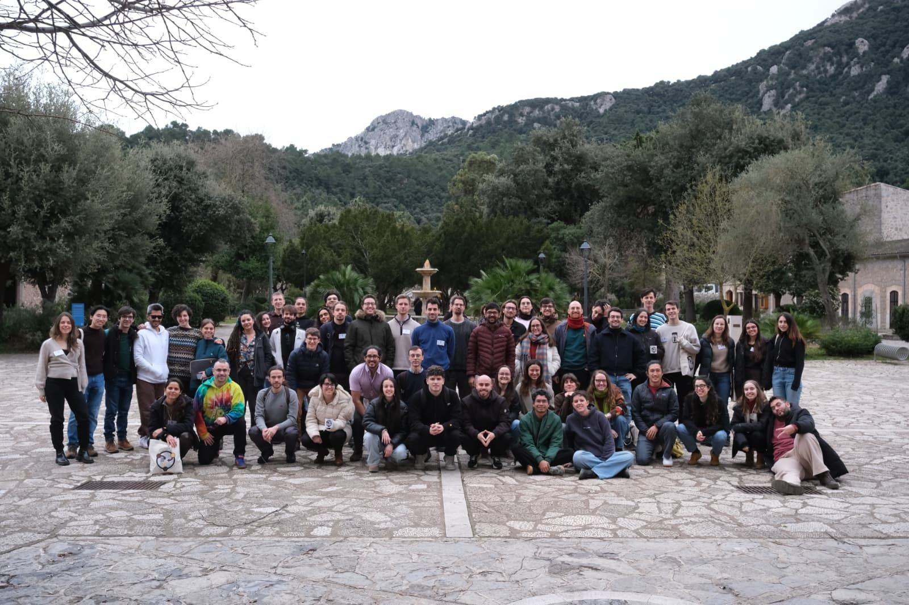
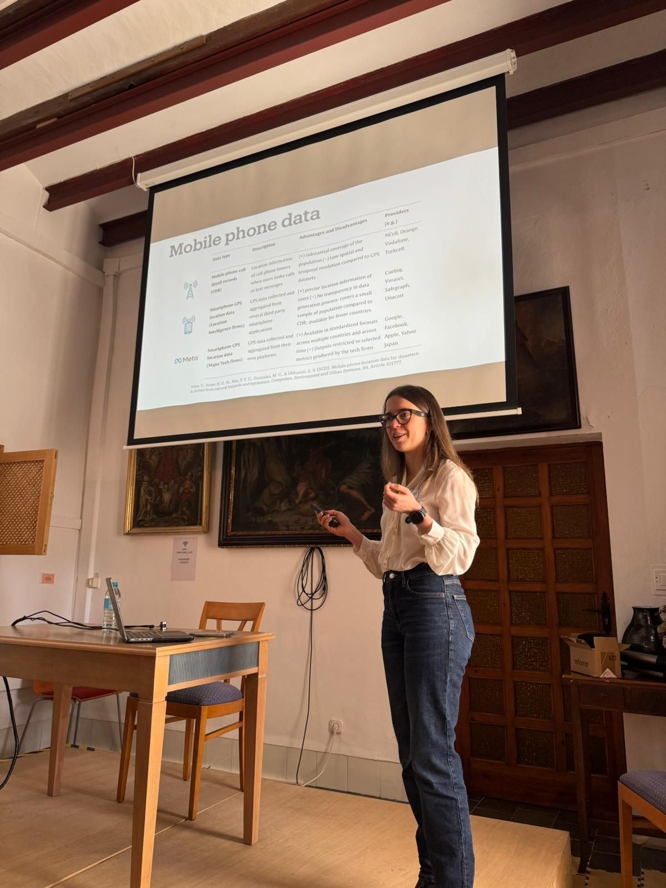

Carmen gave a keynote at the 11th [Winter Workshop on Complex Systems](https://wwcs2026.github.io/), held in Santuari de Lluc, Mallorca, from the 25th to the 30th of January 2026.

The Winter Workshop on Complex Systems is a one-week event where young PhD and postdoctoral researchers from around the world come together to develop interdisciplinary projects in complex systems. The workshop has a long history of bringing participants together in an intensive research setting, with the 2026 edition hosted in Mallorca, Spain.

Carmen's keynote introduced the DEBIAS framework and ongoing work on the analysis of digital trace data to evaluate the impact of disruptions to day-to-day mobility. The talk connected DEBIAS to wider work on disruption and inequality in mobility, including research showing how [extreme heat reduces and reshapes urban mobility](https://doi.org/10.1093/pnasnexus/pgag078) and how [sustained changes to urban mobility after COVID-19 amplified socio-economic inequalities in Latin America](https://arxiv.org/abs/2504.15871). 

