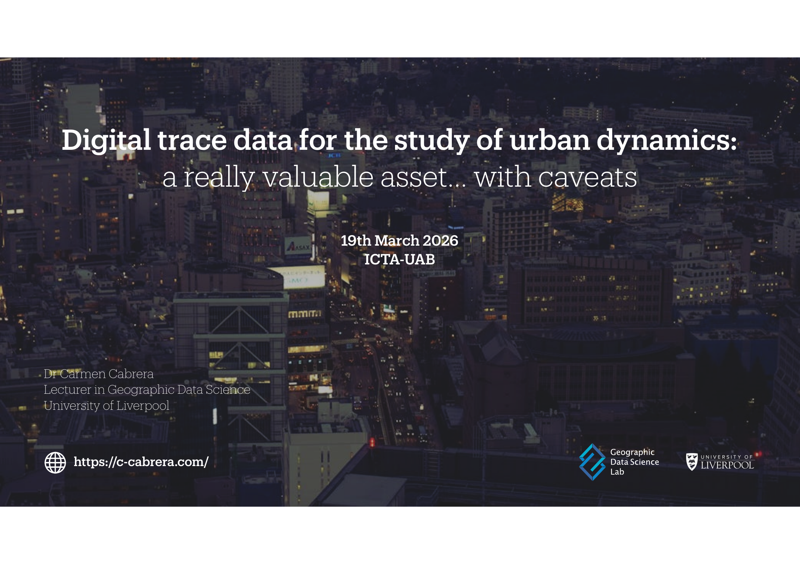
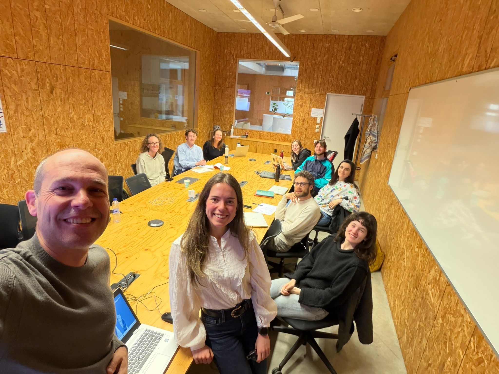

Carmen presented *Digital trace data for the study of urban dynamics: a really valuable asset… with caveats* at City Lab Barcelona, hosted by the Institute of Environmental Science and Technology at the Universitat Autònoma de Barcelona (ICTA-UAB), on 19 March 2026.

The talk explored how digital trace data can support the study of urban dynamics by offering timely, spatially detailed insights into how people move through and use cities. It also reflected on the caveats that come with these data, including questions of representativeness, coverage, bias and the risks of drawing conclusions from populations that are unevenly captured by digital systems.

City Lab Barcelona, led by Jordi Honey-Roses, studies the impacts of urban projects, policies and interventions through formal experiments and direct observation. The group works across impact evaluation, tactical urbanism, experimentation and applied partnerships to generate knowledge that can accelerate the transition to more sustainable urban planning and design.

