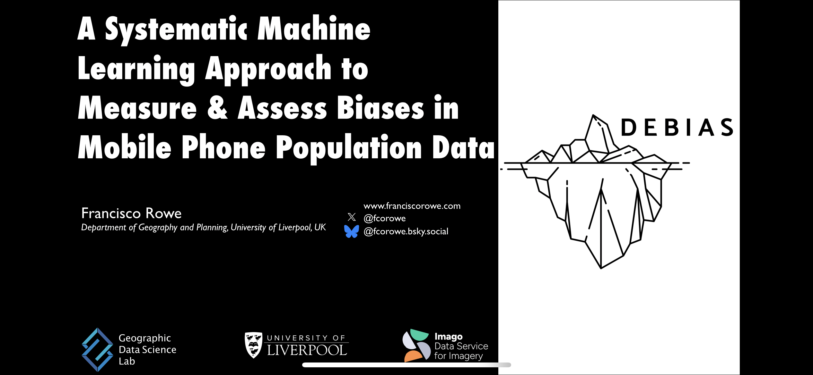

Francisco presented *A systematic machine learning approach to measure and assess biases in mobile phone population data* at Seminario Ciencias Sociales, hosted by Universidad de la Republica in Montevideo, Uruguay, on 25 March 2026.

Traditional sources of population data, such as censuses and surveys, are costly, infrequent, and often unavailable in crisis-affected regions. Mobile phone application data offer near real-time, high-resolution insights into population distribution, but their utility is undermined by unequal access to and use of digital technologies, creating biases that threaten representativeness. Despite growing recognition of these issues, there is still no standard framework to measure and explain such biases, limiting the reliability of digital traces for research and policy.

The talk presented a systematic, replicable framework to quantify coverage bias in aggregated mobile phone application data without requiring individual-level demographic attributes. The approach combines a transparent indicator of population coverage with explainable machine learning to identify contextual drivers of spatial bias. Using four datasets for the United Kingdom benchmarked against the 2021 census, the work shows that mobile phone data consistently achieve higher population coverage than major national surveys, but substantial biases persist across data sources and subnational areas.

Coverage bias is strongly associated with demographic, socioeconomic, and geographic features, often in complex nonlinear ways. Contrary to common assumptions, multi-application datasets do not necessarily reduce bias compared to single-app sources. These findings provide a foundation for bias assessment standards in mobile phone data and offer practical tools for researchers, statistical agencies, and policymakers seeking to use these data responsibly and equitably.

