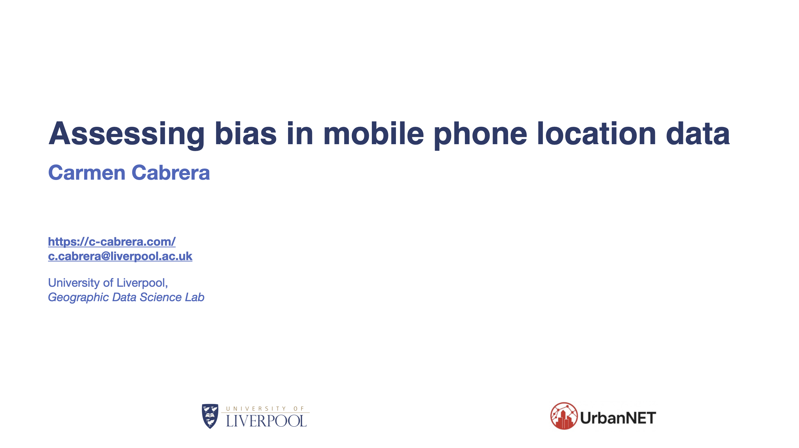
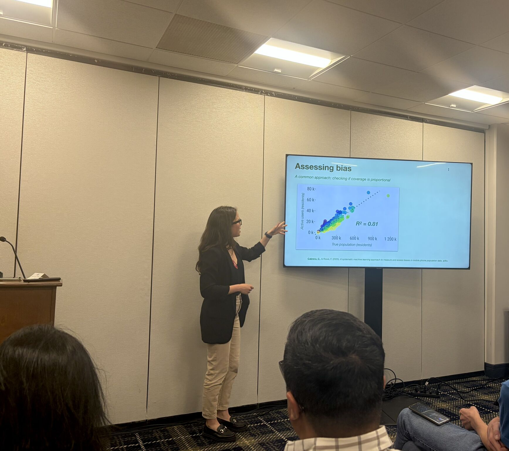

Carmen visited Boston to meet with DEBIAS project partners and present the project at UrbanNET, a satellite session of the NetSci Conference.

On the 29th of May 2026, Carmen visited Northeastern University Network Science Institute, where she met with Professor Esteban Moro and the Social Urban Networks (SUN) group. The visit provided an opportunity to discuss the group's work on urban mobility, social mixing and the impacts of transport interventions, as well as ongoing connections with the DEBIAS project.

Carmen also visited MIT Senseable City Lab, where she met with Paolo Santi, Francois Gu and Pei Zhao to exchange ideas on data bias, remote work patterns, truck electrification and other emerging directions in urban data science.

During the visit, Carmen presented DEBIAS at UrbanNET, one of the NetSci satellite sessions focused on urban systems, network science and complex systems methods. The session brought together researchers working with conventional and non-conventional data to understand urban mobility networks, city structure, socio-economic patterns, neighbourhood dynamics and the design and management of resilient urban systems.

The Boston visit created a valuable opportunity to connect DEBIAS with leading research groups working at the intersection of human mobility, digital traces, network science and urban analytics.

