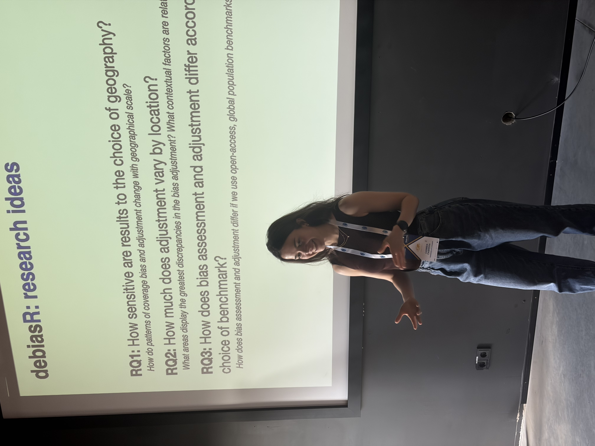
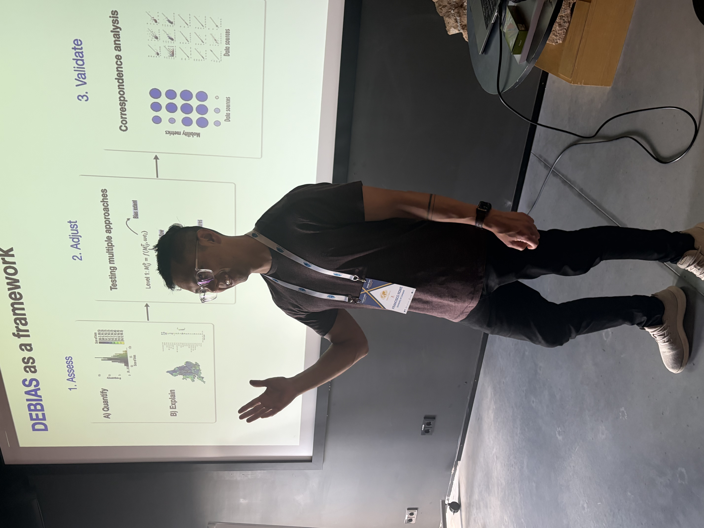

Carmen and Francisco led the workshop *Correcting Biases in Mobile-Phone Mobility Data: The DEBIAS Framework* at the Mobile Tartu PhD School, part of the 10th Mobile Tartu Conference hosted by the Mobility Lab at the University of Tartu.

The workshop took place on the 7th and 8th June 2026 and introduced the DEBIAS project and (importantly!) a beta version of `debiasR`, a new R package under development to help identify, assess and correct coverage and representativeness biases in digital trace mobility data. Drawing on digital traces from sources such as GPS data and Call Detail Records, the session focused on how researchers can produce more reliable estimates of human mobility and critically engage with the biases embedded in these data.

Participants worked through the conceptual foundations of the DEBIAS framework before applying `debiasR` in practical data analysis and group exercises. The workshop created space for doctoral researchers to test the package, reflect on its development and explore how bias correction methods can support urban, transport and demographic research using digital mobility data. On the 9th of June, attendees presented the work they had developed during the workshop, offering great insights as `debiasR` continues to evolve.

Mobile Tartu brings together researchers working on human mobility, mobile big data and mobility data justice for resilient, just and sustainable societies. The PhD School provided a lively setting to share early DEBIAS tools with an international group of doctoral researchers and involve participants directly in the package development process.

