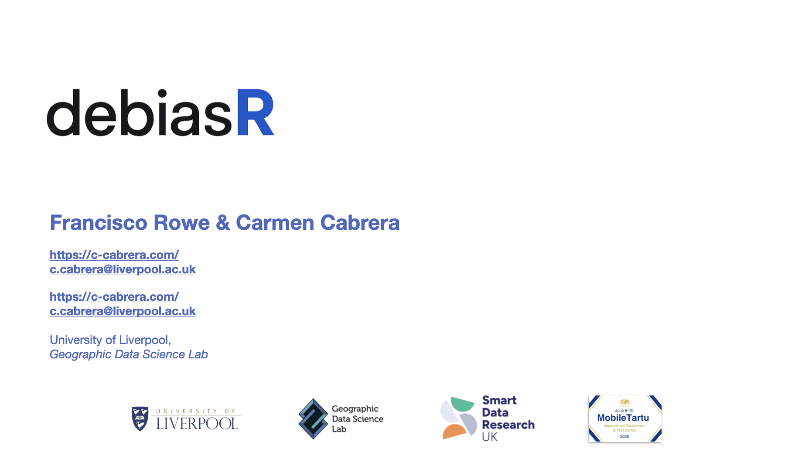

Carmen and Francisco brought DEBIAS to [Mobile Tartu](https://mobiletartu.ut.ee/). Mobile Tartu brings together researchers working on human mobility, mobile big data and mobility data justice for resilient, just and sustainable societies. 

On the 7th and 8th of June, both Carmen and Francisco led the workshop *Correcting Biases in Mobile-Phone Mobility Data: The DEBIAS Framework* at the Mobile Tartu PhD School, part of the 10th Mobile Tartu Conference hosted by the Mobility Lab at the University of Tartu. The workshop introduced the DEBIAS project and (importantly!) a beta version of [debiasR](https://de-bias.github.io/debiasR/), a new R package under development to help identify, assess and correct coverage and representativeness biases in digital trace mobility data. Drawing on digital traces from sources such as GPS data and Call Detail Records, the session focused on how researchers can produce more reliable estimates of human mobility and critically engage with the biases embedded in these data. Participants worked through the conceptual foundations of the DEBIAS framework before applying `debiasR` in practical data analysis and group exercises. Attendees had the chance to present the work they had developed during the workshop, offering great insights as `debiasR` continues to evolve.

On the 9th of June, Francisco presented the DEBIAS progress at the The World Bank Group session supported through Global Data Facility programme chaired by the skilful Siim Esko, from [Positium](https://positium.com/).

