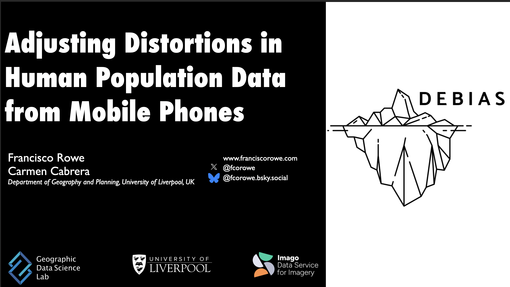

At the [10th Mobile Tartu Conference](https://mobiletartu.ut.ee/), [Francisco Rowe](https://www.liverpool.ac.uk/people/francisco-javier-rowe-gonzalez) and [Carmen Cabrera](https://www.liverpool.ac.uk/people/carmen-cabrera-arnau) presented DEBIAS work in the World Bank Session on [“Challenges in Mobile Phone Data-Based Research”](https://mobiletartu.ut.ee/programme/).
The talk was titled “Adjusting Distortions in Human Population Data from Mobile Phones”.

The presentation addressed a central problem for the use of mobile phone and app-derived data in population research: these data offer high-frequency, spatially granular and near-real-time information, but they are not collected for research purposes.
As a result, they can provide useful signals about spatial patterns, trends and changes in human mobility, while still producing distorted population-level estimates if their biases are ignored.

The talk introduced the logic of DEBIAS.
Traditional data sources such as censuses and surveys remain essential, but they can be expensive, infrequent, slow to release and geographically constrained.
By contrast, digital trace data can support more timely evidence for planning and decision-making, particularly in contexts shaped by rapid-onset hazards such as epidemics, conflict and natural disasters.
The challenge is that digital traces are selective windows into the population, shaped by differences in access, engagement and use across groups and places.

Francisco and Carmen presented a framework for measuring, explaining and adjusting these distortions.
The approach starts by quantifying bias in mobile-phone-derived population estimates, using benchmark population data to assess spatial coverage and representativeness.
It then uses spatial analysis and explainable machine learning to identify the contextual features associated with bias across different data sources.
The presentation showed that bias varies across sources and places, that residual distortions can remain even when overall spatial proportionality is high and that key predictors of bias often operate through complex non-linear relationships.

The talk also outlined the next stage of DEBIAS: developing a general adjustment and validation framework for mobility flows.
This includes Bayesian multilevel modelling to estimate true unobserved flows, account for source-specific bias and incorporate contextual information, followed by validation against benchmark mobility data.
These ideas are being implemented through [debiasR](https://github.com/de-bias/debiasR), the DEBIAS R package designed to support transparent and reproducible bias assessment and correction.

The main message was clear: mobile phone data can greatly enhance our understanding of human mobility for policy and planning, but only if biases are treated as a core methodological issue rather than a secondary limitation.
Responsible use of digital trace data requires replicable quality assessment, source-specific adjustment strategies and a recognition that digital data are shaped by persistent and changing digital divides.

