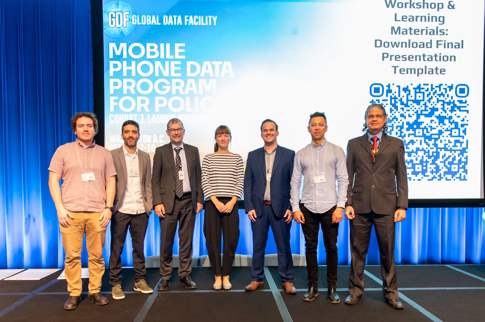

Francisco was invited as an expert in the use of mobile phone data to capture human mobility to the Global Data Facility Mobile Phone Data (GDF-MPD) Program for Policy: Cohort 1 Launch Workshop. The workshop took place at the World Bank in Washington DC in parallel to the 2024 NetMob conference. The GDF-MDP programme aims to:

-   Deliver essential resources and programmatic activities to support WB task teams to integrate MPD into national data systems for durable policy solutions and statistics

-   Promote open MPD standards, tools, and practices

-   Deliver programmatic activities designed to advance the level of maturity in the local MPD ecosystem

-   Promote operational research to improve evidence-base and policy impact of MPD

-   Use grant activities to facilitate lending in integrated national data systems and public data infrastructure

After a competitive application process, task teams representing 18 countries were selected to join the first Cohort of the MPD-GDF Program. These teams were grouped into three clusters: LAC, West Africa and Integrated. During the workshop, the country teams developed their strategic implementation plans to put MPD to work for Policy in a rigorous and sustainable way. The workshop delivered sessions that cover: (a) process to set up a country Mobile Phone Data pipeline/program in a country to produce policy-relevant insights; (b) country examples of MPD for policy applications; and, (c) group activities to develop/elaborate country MPD implementation plan. MPD experts, including Francisco, contribute to present use cases where MDP has worked, discussed some of the existing challenges of their use, and supported Brazil to develop a strategic implementation plan for the adoption of MDP to develop statistical indicators to inform urban planning decision making.

The Brazilian team included [Claudio Ferreira](https://www.linkedin.com/in/claudio-ferreira-jr-832b2529/) from Ministério das Cidades, [Marcio Mutti](https://www.linkedin.com/in/marciomutti/) from Anatel, [Daniel Oliveira](https://www.linkedin.com/in/daniel-oliveira-62956a26/) from Serpro and [Aiga Stokenberga](https://www.linkedin.com/in/aiga-stokenberga-7143543b/) and [Andrea Barone](https://www.linkedin.com/in/abarone/) from The World Bank. 

{fig-align="\"centre"}
