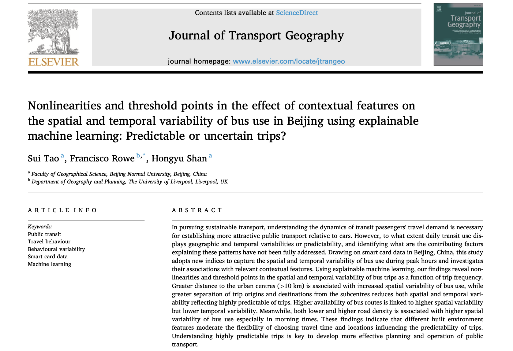

Francisco published a [new article](https://www.sciencedirect.com/science/article/pii/S0966692325000171?via%3Dihub) in the Journal of Transport Geography.
The paper explores data from Beijing's bus system.
Specifically the paper sought to address: How predictable are public transit trips, and what factors shape this predictability?
Leveraging 20 million bus trips from Beijing, the study analysed patterns of spatial and temporal variability in bus use, with the idea of informing interventions to create more sustainable transit systems.

Key takeaways: ️

-   Bus trips beyond 10 km from urban centers show greater variability in timing and routes.

-   A higher density of bus routes reduces unpredictability, but adding too many routes has diminishing returns.

-   Both low and high road densities increase variability, impacting travel predictability.

Using explainable machine learning (XGBoost and SHAP values), our analysis presents evidence of nonlinear relationships and tipping points—critical for designing responsive, efficient transit systems.

What does this mean for urban mobility?

-   Prioritize areas on the outskirts of cities with tailored route planning.

-   Focus on densifying road networks in sparse regions, but avoid oversaturation.

-   Create transit systems that adapt to behavioral patterns, offering more flexibility and reliability.

These findings are a step toward building transit systems that reduce car dependency, combat climate change, and enhance urban sustainability.

