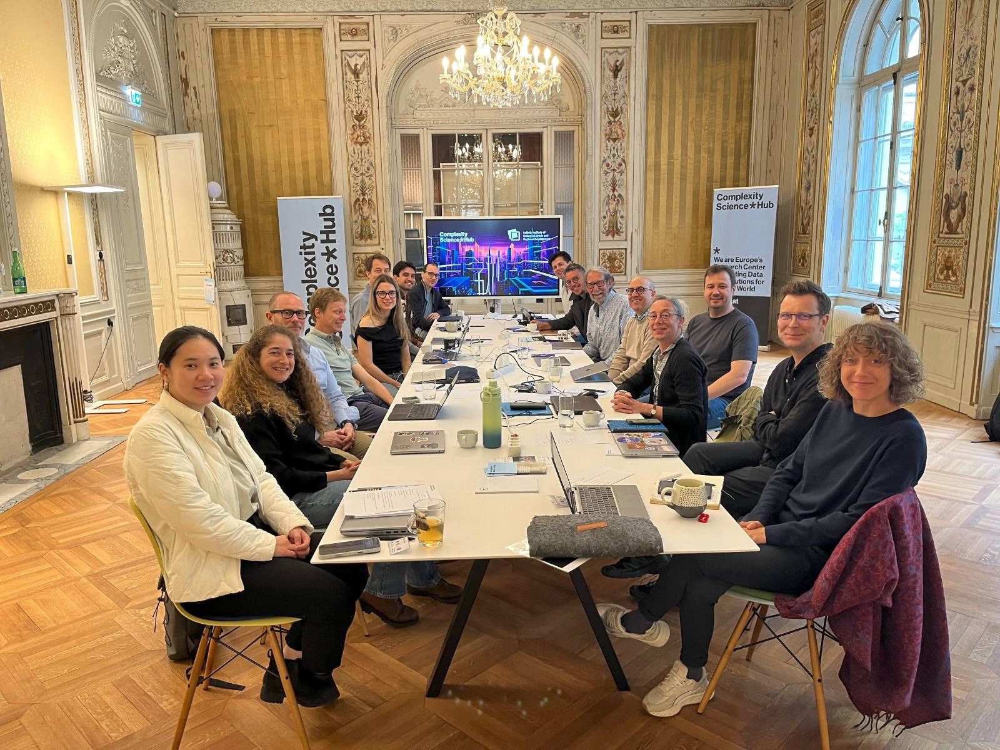

Carmen was invited to participate in the workshop titled "Cities as Complex Systems (CtCS2025) – Lessons Learned from Three Decades of Urban Complexity Science: Formulating Policy Recommendations", organised by the [Complexity Science Hub](https://complenet.weebly.com/), in Vienna, Austria, from May 4–5, 2025. The event brought together leading researchers in urban complexity science from institutions such as the Santa Fe Institute, University of Chicago, University College London, Columbia University, and the Leibniz Institute of Ecological Urban and Regional Development. The aim was to reflect on key insights from the past thirty years of urban complexity research and to formulate evidence-based policy recommendations for the future.

Representing the University of Liverpool and the Geographic Data Science Lab, Carmen was invited to deliver a stimulus talk to help guide and inspire some of the workshop discussions. In her presentation, she highlighted the potential of digital trace data for advancing our understanding of urban mobility. Mobility, she argued, is a core feature of urban life, underpinning the dynamic flows of people, goods, and information that define cities as complex systems. Carmen also addressed the methodological and ethical challenges that come with using digital trace data in policy-relevant research. Issues related to data accessibility, representativeness and the translation of complex findings into actionable policy recommendations remain significant hurdles. Her talk emphasised the need for DEBIAS's methodological framework to mitigate biases in digital trace data. 

