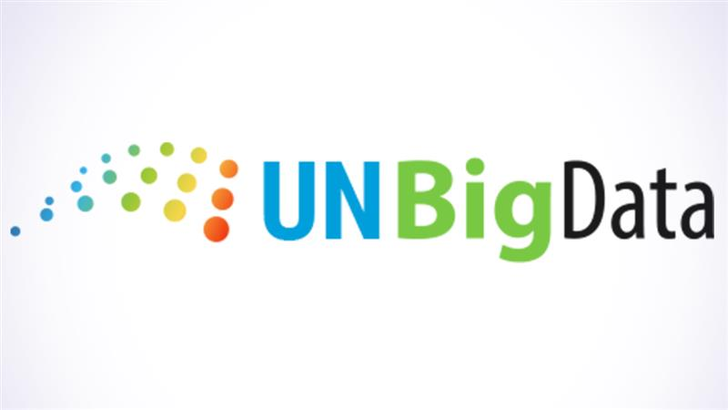

Carmen has joined the [United Nations Committee of Experts on Big Data and Data Science for Official Statistics](https://unstats.un.org/bigdata/) (UN-CEBD).

She will contribute to the [Mobile Phone Data Task Team](https://unstats.un.org/bigdata/task-teams/mobile-phone/index.cshtml), which supports the responsible use of mobile phone data in official statistics by developing methodological guidance, technical resources and best practices for national statistical offices.

As part of this work, Carmen will contribute to the development of a methodological guide on the use of mobile phone data in transport statistics. She will lead the section on data quality and bias, drawing on DEBIAS research.

This role strengthens the contribution of DEBIAS to international efforts to help statistical systems use new forms of mobility data responsibly, transparently and with careful attention to the limitations of the data.

{fig-align="centre"}
