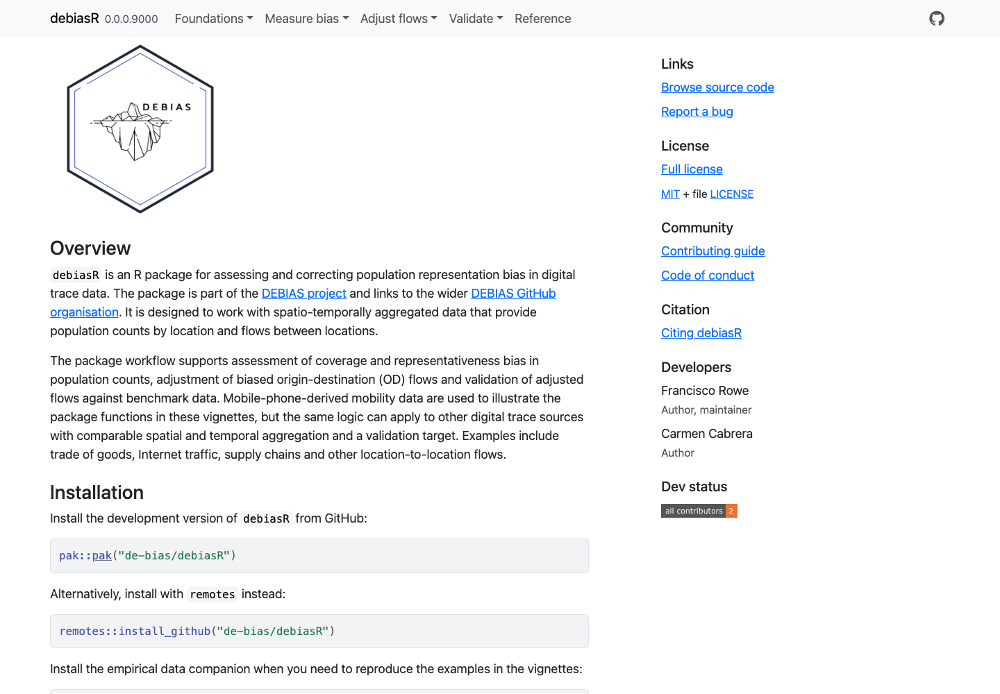

We are pleased to announce the release of the first beta testing version of [`debiasR`](https://de-bias.github.io/debiasR/), our new R software package for assessing and correcting population representation bias in digital trace data.

`debiasR` is being developed as part of the [DEBIAS project](https://de-bias.github.io/debias/), which aims to create a framework to measure and correct biases in human mobility data extracted from digital footprints.
The package is designed to support researchers, analysts and data providers working with spatio-temporally aggregated population data, including population counts by location and origin-destination flows between places.

The current beta version provides tools and documentation to support three core tasks:

1. measuring coverage and representativeness bias in population count data;
2. adjusting biased origin-destination mobility flows; and
3. validating adjusted mobility flows against benchmark data.

Mobile-phone-derived mobility data are used to illustrate the package functions, but the underlying logic can be applied to other digital trace data sources with similar spatial and temporal aggregation structures and an appropriate validation target.

The package can be installed from GitHub using:

```r
pak::pak("de-bias/debiasR")
```

or alternatively:

```r
remotes::install_github("de-bias/debiasR")
```

Users who want to reproduce the empirical examples in the vignettes can also install the companion data package:

```r
pak::pak("de-bias/debiasRdata")
```

This is an early testing version.
We are now inviting researchers, developers and potential users to install the package, test its stability and help us identify bugs, usability issues, missing documentation and opportunities for improvement.

Feedback can be submitted through the [`debiasR` GitHub repository](https://github.com/de-bias/debiasR).
Please use [GitHub Issues](https://github.com/de-bias/debiasR/issues) to report bugs, request features or suggest methodological improvements.
We also welcome contributions through pull requests, following the package [contributing guidelines](https://de-bias.github.io/debiasR/CONTRIBUTING.html).

The first formal alpha release is expected in July 2026.
Feedback during this beta testing phase will help us improve the package before that release and ensure that `debiasR` is robust, transparent and useful for the wider mobility data research community.


