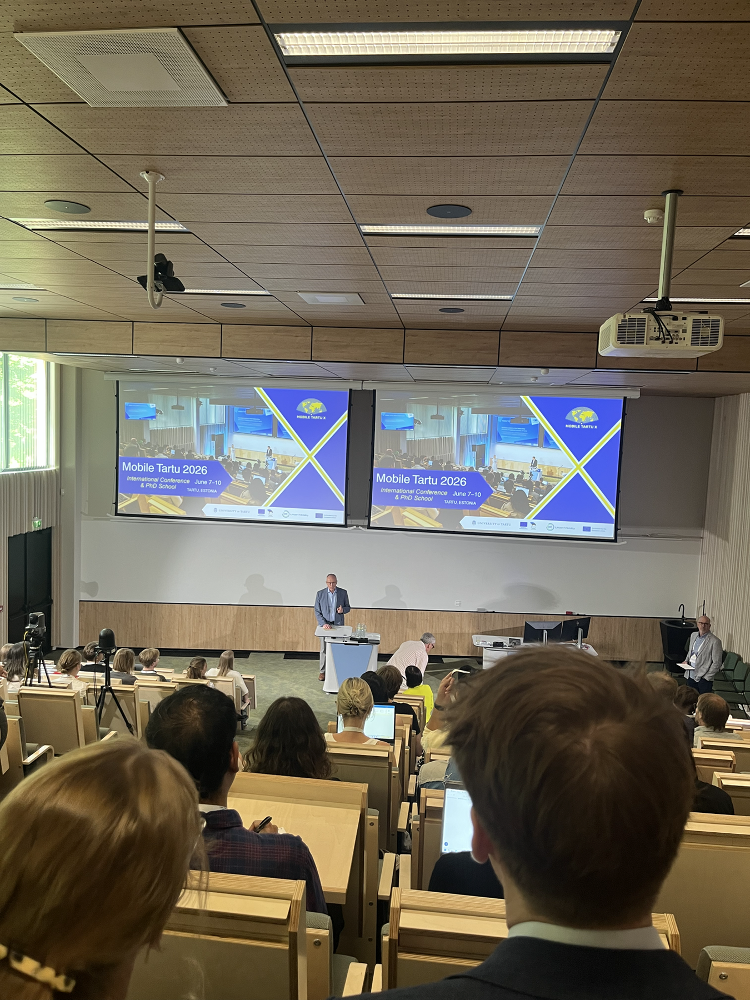

The DEBIAS team participated in the [10th Mobile Tartu Conference](https://mobiletartu.ut.ee/), hosted by the [Mobility Lab](https://mobilitylab.ut.ee/) at the [University of Tartu](https://ut.ee/en).
The conference brought together an international community working on human mobility, mobile big data and digital traces, with a strong focus on resilient, just and sustainable societies.

[Francisco Rowe](https://www.liverpool.ac.uk/people/francisco-javier-rowe-gonzalez) and [Carmen Cabrera](https://www.liverpool.ac.uk/people/carmen-cabrera-arnau), from the [Geographic Data Science Lab](https://www.liverpool.ac.uk/geographic-data-science/) at the [University of Liverpool](https://www.liverpool.ac.uk/), contributed to the conference and PhD School through three DEBIAS-related activities.

First, we led the PhD School workshop [“Correcting Biases in Mobile-Phone Mobility Data: The DEBIAS Framework”](https://mobiletartu.ut.ee/workshops-and-academic-lecture/).
The workshop introduced doctoral researchers to the DEBIAS framework and the beta version of [`debiasR`](https://github.com/de-bias/debiasR), our new open-source R package for identifying, assessing and adjusting coverage and representativeness biases in mobile-phone-derived mobility data.
Participants worked through conceptual, methodological and practical exercises on how to diagnose bias, apply correction methods and validate adjusted outputs against benchmark mobility data.

Second, Francisco and Carmen presented the workshop outcomes with PhD School participants as part of the Mobile Tartu programme.
This provided an opportunity to discuss how early-career researchers can use DEBIAS tools to critically evaluate the quality of digital trace data before using them for substantive mobility analysis.

Third, Francisco presented DEBIAS research in the World Bank Session on [“Challenges in Mobile Phone Data-Based Research”](https://mobiletartu.ut.ee/programme/).
The session connected directly with the aims of the [World Bank Global Data Facility Mobile Phone Data Programme](https://www.worldbank.org/en/programs/global-data-facility/brief/putting-mobile-phone-data-to-work-for-policy), which supports the responsible integration of mobile phone data into national data systems and policy applications.
The session was chaired by [Esperanza Magpantay](https://blogs.worldbank.org/en/team/e/esperanza-magpantay) from the [International Telecommunication Union](https://www.itu.int/) and [Siim Esko](https://positium.com/about/our-people) from [Positium](https://positium.com/).

The conference also created valuable opportunities to strengthen links between DEBIAS, the [UN Committee of Experts on Big Data and Data Science for Official Statistics](https://unstats.un.org/bigdata/), the World Bank GDF-MPD programme and the wider international community developing methods for responsible, transparent and policy-relevant use of mobile phone data.

We are grateful to [Age Poom](https://mobilitylab.ut.ee/people/), [Anto Aasa](https://mobilitylab.ut.ee/people/), [Olle Järv](https://mobilitylab.ut.ee/people/) and the wider Mobility Lab organising team for hosting such a stimulating conference.
We also thank [Smart Data Research UK](https://www.sdruk.ukri.org/) for supporting DEBIAS and making this work possible.

