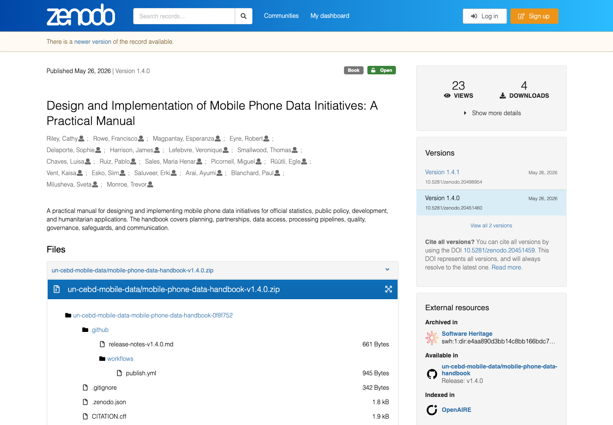

We are pleased to share that [Francisco Rowe](https://www.liverpool.ac.uk/people/francisco-javier-rowe-gonzalez), Professor in Population Data Science at the [University of Liverpool](https://www.liverpool.ac.uk/) and Lead of the [Geographic Data Science Lab](https://www.liverpool.ac.uk/geographic-data-science/), has contributed to the new [UN-CEBD Task Team on Mobile Phone Data](https://unstats.un.org/bigdata/task-teams/mobile-phone/index.cshtml) Practical Manual: [Design and Implementation of Mobile Phone Data Initiatives](https://doi.org/10.5281/zenodo.20451460).

The manual provides practical guidance for organisations seeking to design and implement mobile phone data initiatives for official statistics, public policy, development and humanitarian applications.
It covers key aspects of the implementation journey, including institutional readiness, partnerships with mobile network operators, data access, governance, privacy, safeguards, processing pipelines, quality assurance and communication.

The resource was developed through the UN-CEBD Task Team on Mobile Phone Data, which brings together experts working to advance the ethical, secure and high-quality integration of mobile phone data into official statistics.
It was launched in connection with the Global Data Festival session [“Global Push to Put Mobile Phone Data to Work for Statistics”](https://www.worldbank.org/en/events/2026/06/03/global-data-festival-2026), which highlighted how mobile phone data can support more timely, granular and responsive statistics for policy and decision-making.

Francisco’s contribution builds on the wider aims of [DEBIAS](https://de-bias.github.io/debias/): developing methods and tools to identify, assess and correct biases in human mobility data derived from digital traces.
Mobile phone data can offer valuable evidence on population mobility, migration, tourism, population dynamics, disaster contexts and information society indicators.
Yet their responsible use depends on robust governance, clear implementation pathways and systematic attention to data quality, coverage and representativeness.

The manual is also closely aligned with the [Global Data Facility Mobile Phone Data Programme](https://www.worldbank.org/en/programs/global-data-facility/brief/putting-mobile-phone-data-to-work-for-policy), a joint initiative of the [World Bank](https://www.worldbank.org/) and the [International Telecommunication Union](https://www.itu.int/), which supports countries in sustainably adopting mobile phone data as a source for producing timely and policy-relevant statistics.

We encourage national statistical offices, telecommunications regulators, ministries, policymakers, development partners, researchers and mobile phone data practitioners to explore the manual and use it as a practical resource for responsible mobile phone data initiatives.

The manual is available here: [Design and Implementation of Mobile Phone Data Initiatives](https://doi.org/10.5281/zenodo.20451460).

