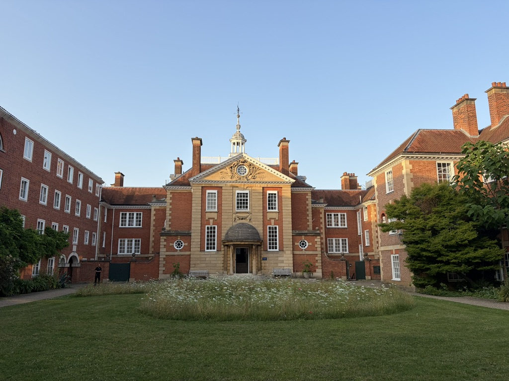

Carmen was invited to give a lecture at the [Oxford Summer School in Economic Networks](https://www.maths.ox.ac.uk/events/summer-schools/economic-networks) on the 24th of June 2026.
The session took place at Lady Margaret Hall, [University of Oxford](https://www.ox.ac.uk/).

The lecture, titled *Urban systems, as portrayed by digital traces*, introduced participants to the use of digital trace data in urban research and presented the DEBIAS framework.

The lecture was followed by a hands-on computational tutorial in Python prepared by Jishan Duan and Miao Zeng, PhD candidates at [UCL](https://www.ucl.ac.uk/)'s [Centre for Advanced Spatial Analysis](https://www.ucl.ac.uk/casa).
The tutorial enabled participants to work directly with mobile phone data and explore practical questions related to coverage and representativeness bias.

## Python tutorial materials

The code and supporting materials are openly available through the OSSEN mobile phone data bias tutorial repository:

[Access the Python tutorial on GitHub](https://github.com/jishan96/OSSEN_MPD_bias){.btn .btn-primary target="_blank"}

The Oxford Summer School in Economic Networks brings together postgraduate researchers from different disciplines to learn about network theory, quantitative methods and their applications.
The Summer School is affiliated with the [Institute for New Economic Thinking](https://www.inet.ox.ac.uk/) at the [Oxford Martin School](https://www.oxfordmartin.ox.ac.uk/) and the [University of Oxford's Mathematical Institute](https://www.maths.ox.ac.uk/).

