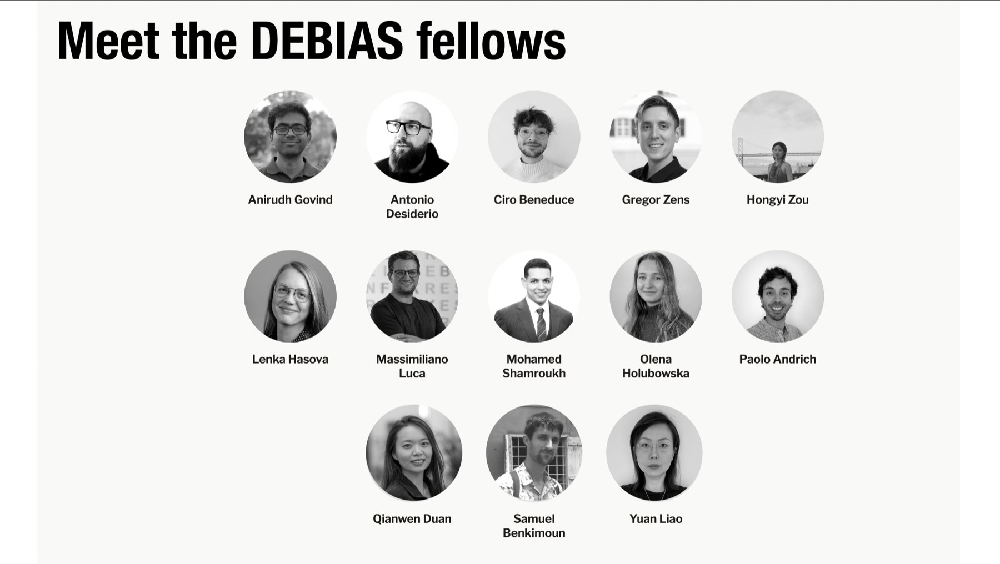

We are pleased to announce the launch of the DEBIAS Fellow Network, a new international community of researchers and practitioners working on digital trace data, human mobility, population measurement and responsible data science.

The Fellow Network will create a space for sustained exchange around the central questions that motivate [DEBIAS](https://de-bias.github.io/debias/): how to identify, assess and correct biases in mobility data derived from digital footprints.
These questions are increasingly important as mobile phone, app-derived and other digital trace data are used to support research, official statistics, humanitarian response, urban planning and policy analysis.

Our first cohort brings together Anirudh Govind, Antonio Desiderio, Ciro Beneduce, Gregor Zens, Hongyi Zou, Lenka Hasova, Massimiliano Luca, Mohamed Shamroukh, Olena Holubowska, Paolo Andrich, Qianwen Duan, Samuel Benkimoun and Yuan Liao.
The Fellows bring expertise across geographic data science, computational social science, migration and mobility research, official statistics, machine learning, data governance and applied policy analysis.

Through the network, Fellows will contribute to DEBIAS project ideas, extensions, presentations, methods discussions, software testing, software development and more.
They will help us refine the DEBIAS framework, strengthen documentation and examples for [`debiasR`](https://github.com/de-bias/debiasR), develop applied case studies and identify practical challenges that arise when digital trace data are used to produce population and mobility evidence.

The network also reflects a broader aim of DEBIAS: building methods that are not only technically robust, but also transparent, reproducible and useful for the communities that rely on mobility data.
By connecting researchers across institutions, countries and application areas, the Fellow Network will support shared learning on how to diagnose bias, validate adjusted outputs and communicate uncertainty in ways that can improve responsible data use.

We look forward to working with the DEBIAS Fellows and to sharing their contributions through future project updates, workshops and software releases.

