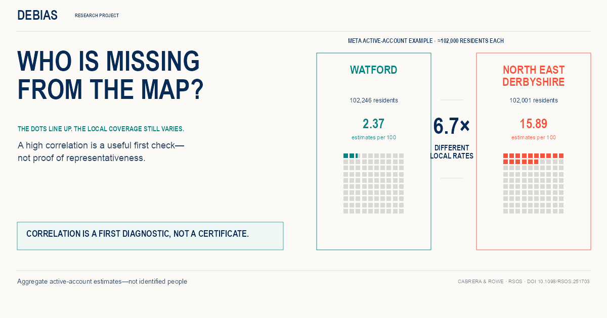

Our study on hidden biases in mobile phone population data is now published in *Royal Society Open Science*, and we have released an accompanying interactive data story.

[Making hidden biases visible in population location data from mobile phones](https://doi.org/10.1098/rsos.251703), by Carmen Cabrera and Francisco Rowe, compares four mobile-app datasets with the 2021 Census across 331 local authority areas in England and Wales.
A strong aggregate correlation with Census counts coexists with substantial variation in local coverage; the same places shift position across sources, and coverage bias relates to area characteristics in different, often nonlinear ways.
The results show that representativeness must be diagnosed and adjustments validated source by source.

To make these findings accessible beyond the paper, we built [*Who is missing from the map?*](https://de-bias.github.io/debias/stories/making-hidden-biases-visible/), a two-act scrollytelling story that walks through the evidence interactively, including a local-authority explorer and a source-by-source view of area-level drivers of bias.

[Explore the story](https://de-bias.github.io/debias/stories/making-hidden-biases-visible/) · [Read the published article](https://doi.org/10.1098/rsos.251703)

