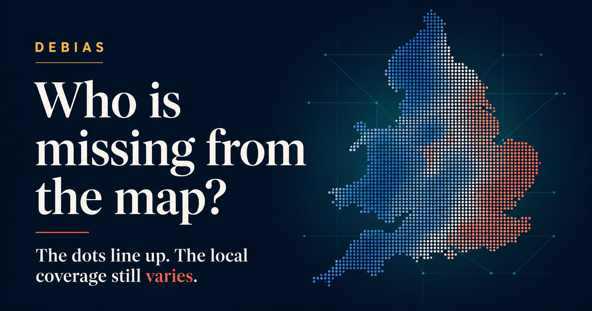

Digital-trace data can provide timely, geographically detailed population signals when censuses and surveys are too slow for rapidly unfolding challenges. Yet these data can also be biased, producing a distorted representation of local populations.

Our study, [*Making hidden biases visible in population location data from mobile phones*](https://doi.org/10.1098/rsos.251703), compares four mobile-app datasets with the 2021 Census across 331 local authority areas in England and Wales. It shows that a strong correlation between resident and active-user population counts does not assess bias or representativeness. Local coverage varies substantially, the same places change position across data sources, and coverage relates to population attributes in different and often nonlinear ways.

Our revised interactive story, *Who is missing from the map?*, now guides readers from the value and limitations of digital-trace data through the evidence on local coverage, cross-source differences and the population attributes associated with under- or over-representation. It includes a local-authority explorer and visual comparisons across Twitter/X, Meta and two multi-application datasets.

[Explore the interactive story →](https://de-bias.github.io/debias/stories/making-hidden-biases-visible/){.btn .btn-primary .btn-lg role="button"}

[Read the published article](https://doi.org/10.1098/rsos.251703)

